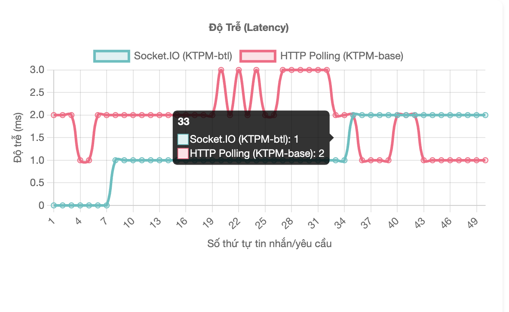

# Hệ Thống Key-Value Thời Gian Thực (KTPM-BTL)

Một hệ thống lưu trữ và phân phối cặp key-value thời gian thực có khả năng mở rộng được thiết kế cho dữ liệu cập nhật liên tục như giá tiền điện tử, báo giá chứng khoán và thông tin tài chính.

## Các thành viên của nhóm gồm có
```
Bùi Đỗ Khôi Nguyên - 22021183
Diệp Xuân Linh - 22021193
Vũ Văn Huy - 22021202
```

## Tổng Quan

KTPM-BTL là một kho lưu trữ key-value hiệu năng cao với kiến trúc microservices hiện đại cung cấp:
- Lưu trữ và truy xuất nhanh các cặp key-value
- Cập nhật thời gian thực qua WebSockets sử dụng Socket.IO
- Khả năng mở rộng theo chiều ngang với Docker containerization
- Bộ nhớ đệm Redis để cải thiện hiệu suất
- Tổ chức dữ liệu theo danh mục

## Tính Năng Chính

- **REST API**: Các endpoint đơn giản cho việc quản lý dữ liệu
- **Cập nhật thời gian thực**: Kiến trúc theo hướng đẩy sử dụng Socket.IO
- **Bảng điều khiển quản trị**: Giao diện trực quan cho việc quản lý dữ liệu
- **Trình xem thời gian thực**: Hiển thị tương tác để theo dõi giá trị trực tiếp
- **Hệ thống danh mục**: Tổ chức dữ liệu với các danh mục có thể tùy chỉnh
- **Hỗ trợ nhiều phiên bản**: Mở rộng theo chiều ngang với cân bằng tải
- **Bộ nhớ đệm Redis**: Giảm tải cơ sở dữ liệu và cải thiện thời gian phản hồi
- **Giới hạn tốc độ**: Bảo vệ chống lạm dụng API

## Công Nghệ Sử Dụng

| Thành phần | Công nghệ |
|-----------|----------|
| **Back-end** | Express.js |
| **Thời gian thực** | Socket.IO với Redis adapter |
| **Nhắn tin** | Redis PubSub |
| **Cơ sở dữ liệu** | PostgreSQL với Sequelize ORM |
| **Bộ nhớ đệm** | Redis (ioredis) |
| **Containerization** | Docker, Docker Compose |
| **Cân bằng tải** | Nginx |
| **Front-end** | HTML, CSS, JavaScript |

## Kiến Trúc Hệ Thống

```
[Trình duyệt Client] <--Socket.IO--> [Cân bằng tải Nginx] <---> [App Instance 1..N]
          |                               |                           |
          |                               |                           v
          |                               |                    [Data Service]
          |                               |                           |
          |                               |             +-------------+-------------+
          |                               |             |                           |
          |                               |             v                           v
          |                               |      [Redis PubSub]               [Redis Cache] <--> [PostgreSQL]
          |                               |             |                           ^
          v                               v             v                           |
[Socket.IO Client] <------------- [App Instance 1..N] --------------------------+
```

### Luồng Dữ Liệu
1. **Đường đi ghi**: Client → API → PostgreSQL → Redis Cache → Redis PubSub → Socket.IO → Clients
2. **Đường đi đọc**: Client → Redis Cache (nếu cache hit) → PostgreSQL (nếu cache miss) → Client
3. **Cập nhật thời gian thực**: Redis PubSub → Socket.IO → Clients

### Hệ Thống Phân Chia Kênh Redis PubSub

KTPM-BTL sử dụng Redis PubSub để phân phối cập nhật dữ liệu giữa các instance với cấu trúc kênh theo danh mục:

#### Cấu trúc kênh:
- **Kênh theo danh mục**: `data-updates:{category}` 
- **Kênh mặc định**: `data-updates:default` (cho dữ liệu không thuộc danh mục cụ thể)

#### Quy tắc định tuyến tin nhắn:
1. **Cập nhật theo danh mục**: Khi dữ liệu được cập nhật, tin nhắn được phát đến kênh tương ứng với danh mục của dữ liệu
2. **Fallback mặc định**: Dữ liệu không thuộc danh mục cụ thể sẽ được phát đến kênh `data-updates:default`

#### Cơ chế đăng ký:
- Mỗi instance đăng ký các kênh cụ thể dựa trên danh mục
- Socket.IO clients được kết nối tới các kênh tương ứng với danh mục họ quan tâm

#### Lợi ích của hệ thống phân chia kênh:
- **Phân tách mối quan tâm**: Dễ dàng tổ chức và quản lý dữ liệu theo chủ đề
- **Tối ưu hóa hiệu suất**: Giảm khối lượng thông điệp không cần thiết, tránh được bottleneck

#### Ví dụ về luồng thông điệp:
1. Client cập nhật giá Bitcoin thông qua API với category "crypto"
2. Giá trị được lưu vào PostgreSQL và Redis Cache
3. Thông điệp được phát đến kênh `data-updates:crypto`
4. Các instances đăng ký nhận thông điệp và cập nhật cho clients thông qua Socket.IO
5. Clients theo dõi giá Bitcoin thấy giá được cập nhật ngay lập tức

## Các Mẫu Thiết Kế

### 1. Publisher/Subscriber
- Sử dụng Redis PubSub để phân phối tin nhắn
- Cho phép nhiều phiên bản nhận cùng một cập nhật
- Hỗ trợ các kênh nhắn tin dựa trên danh mục

### 2. Cache-Aside Pattern
- Kiểm tra bộ nhớ đệm Redis trước khi truy cập cơ sở dữ liệu
- Cập nhật bộ nhớ đệm sau khi đọc cơ sở dữ liệu (cache warming)
- Cập nhật bộ nhớ đệm khi ghi (write-through)

### 3. Retry Pattern
- Xử lý lỗi tạm thời trong các dịch vụ bên ngoài
- Triển khai exponential backoff cho các nỗ lực kết nối lại
- Giảm dần hiệu suất một cách nhẹ nhàng khi các dịch vụ không khả dụng

### 4. Rate Limiting
- Bảo vệ API khỏi lạm dụng và tấn công DoS
- Giới hạn riêng cho các hoạt động đọc và ghi
- Theo dõi tần suất yêu cầu dựa trên IP

## Cài Đặt & Thiết Lập

### 1. Clone repository
```bash
git clone https://github.com/yourusername/KTPM-btl.git
cd KTPM-btl
```

### 2. Tạo cấu hình môi trường
Tạo một tệp `.env` trong thư mục gốc của dự án:

```
PORT=8080

# Cấu hình Cơ sở dữ liệu
DB_HOST=localhost
DB_USER=postgres
DB_PASSWORD=postgres
DB_NAME=ktpm_db
DB_PORT=5432

# Cấu hình Redis
REDIS_HOST=localhost
REDIS_PORT=6379
REDIS_PASSWORD=
REDIS_TTL=600
REDIS_CHANNEL=data-updates
```

### 3. Cài đặt các gói phụ thuộc
```bash
npm install
```

### 4. Khởi chạy với Docker Compose
Để chạy môi trường đầy đủ với PostgreSQL, Redis và Nginx:
```bash
docker-compose up -d
```

### 5. Chế độ phát triển (một phiên bản)
```bash
npm run dev
```

## Các Endpoint API

| Endpoint | Phương thức | Mô tả | Body/Parameters |
|----------|:------:|-------------|----------------|
| `/add` | POST | Thêm hoặc cập nhật một cặp key-value | `{ key: string, value: any, category?: string }` |
| `/get/:key` | GET | Lấy giá trị cho một key | `key`: tham số đường dẫn |
| `/keys` | GET | Liệt kê tất cả các key có sẵn | - |
| `/viewer/:key` | GET | Mở trình xem thời gian thực cho một key | `key`: tham số đường dẫn |
| `/admin` | GET | Mở bảng điều khiển quản trị | - |
| `/benchmark-report` | GET | Hiển thị báo cáo benchmark | - |

## Benchmark & Đánh Giá Hiệu Năng

### Add test


### Get test


### Độ trễ

### Kịch Bản Benchmark

1. **So sánh API GET/ADD**
   - Đo thời gian phản hồi và throughput cho cả hai phiên bản từ 200-1000 connections
   - So sánh tỷ lệ thành công và độ ổn định

2. **Hiệu Năng Cache**
   - So sánh thời gian phản hồi giữa cache hit và cache miss
   - Đánh giá sự cải thiện của Redis cache

3. **Khả Năng Chịu Tải**
   - Test với nhiều requests đồng thời
   - So sánh single-instance và multi-instance deployment

4. **So sánh Socket.IO vs HTTP Polling**
   - So sánh độ trễ giữa cập nhật thời gian thực (Socket.IO) và HTTP Polling truyền thống
   - Đánh giá hiệu quả băng thông và tỉ lệ phát hiện cập nhật
   - Test với 50 clients đồng thời trong 60 giây

### Kết Quả Benchmark

Kết quả benchmark thu thập ngày 5 tháng 5 năm 2025:

| Chỉ số | KTPM-base | KTPM-btl | Cải thiện |
|--------|-----------|----------|-----------|
| GET API (avg time) | 41.52ms | 37.30ms | +10.16% |
| GET API (req/sec) | 5,031 | 5,586 | +11.03% |
| ADD API (avg time) | 98.17ms | 89.84ms | +8.48% |
| ADD API (req/sec) | 2,045 | 2,306 | +12.76% |
| Cache Hit vs Miss | none | 83.57% | Cải thiện đáng kể |

#### Hiệu Năng Cache:
- **Yêu cầu đầu tiên (cold cache)**: 1.42ms
- **Yêu cầu tiếp theo (warm cache)**: 0.23ms
- **Cải thiện từ cache**: 83.57%

#### Hiệu năng socket
   - Socket.IO có độ trễ trung bình thấp hơn 47.18% so với HTTP Polling (2.31ms vs 4.38ms)
   - Socket.IO chỉ cần 5,950 tin nhắn để xử lý cùng số lượng cập nhật mà HTTP Polling cần đến 29,500 requests
   - Cả hai phương pháp đều có độ tin cậy cao với tỉ lệ lỗi 0%
   - HTTP Polling cần trung bình 5 requests để phát hiện 1 cập nhật


